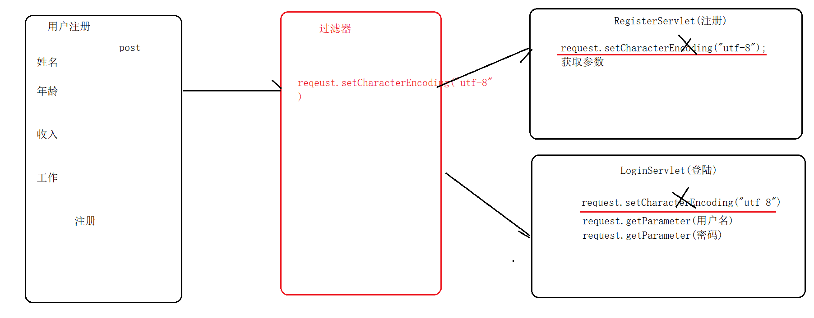
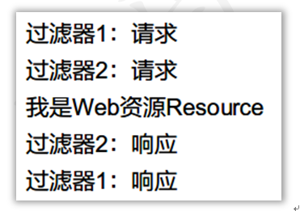

---

title: JavaWeb(06)-过滤器和监听器
tags:
  - 笔记
  - JavaWeb
  - ServletContextListener
  - 过滤器
  - 过滤器链
  - 解决全局乱码
categories:
  - JavaWeb
date: 2020-10-15 19:13:17

---

# 学习目标

**1、能够说出过滤器的作用** 

**2、能够说出过滤器生命周期相关方法** 

**3、能够说出什么是过滤器链** 

**4、能够编写过滤器解决全局乱码** 

**5、能够理解ServletContextListener的作用** 

# 学习内容

## 1. 过滤器的基本概念

### 目标

1. 过滤器的概念

2. JavaWeb的三种组件

3. 过滤器的使用场景

### Java Web的三种组件

| **组件**        | **作用**              |
| ------------- | ------------------- |
| Servlet       | 用于处理用户的请求与响应        |
| Filter（过滤器）   | 用于过滤用户的请求与响应的       |
| Listener(监听器) | 用于监听域对象创建、销毁、增删改属性。 |

### 过滤器的使用场景：

1. **解决全局乱码问题**



2. **用户权限的验证，如果没有登录的用户对请求进行拦截。（粗粒度权限检查）**


### 小结

1. **JavaWeb的三大组件**
   
   - servlet
   
   - Filter(过滤器)
   
   - Listener（监听器）

2. **过滤器的使用场景**
   
   - 解决全局乱码
   - 登陆权限验证

## <font color="red">2. 案例：编写第1个过滤器</font>

### 目标

1. 过滤器的开发步骤

2. 编写第1个过滤器

### 开发过滤器的步骤

1. 创建一个类，实现接口：javax.servlet.Filter接口
2. 实现接口中所有的方法，其中doFilter() 用来处理过滤功能
3. 配置过滤器：使用web.xml 或 使用注解 @WebFilter

### 过滤器的演示案例：

#### 需求

创建一个过滤器HelloFilter，在运行HelloServlet前和后分别输出一句话，在HelloServlet中也输出一句话，观察控制台的运行效果。

#### 执行效果：

​                                                 

#### 注解说明

| **@WebFilter注解属性** | **说明**                |
| ------------------ | --------------------- |
| **filterName**     | 过滤器的名字                |
| **urlPatterns**    | 过滤的地址，可以配置多个，也可以使用通配符 |
| **value**          | 功能同上                  |

#### Filter的代码

```java
package com.itheima.utils;


import javax.servlet.*;
import javax.servlet.annotation.WebFilter;
import java.io.IOException;

/*
学习目标： 编写第一个过滤器

过滤器的编写步骤：
    1. 创建一个类，实现接口：javax.servlet.Filter接口
    2. 实现接口中所有的方法，其中doFilter() 用来处理过滤功能
    3. 配置过滤器：使用web.xml 或 使用注解 @WebFilter

 */

@WebFilter("/demo1")
public class Demo1Filter implements Filter {


    @Override
    public void doFilter(ServletRequest request, ServletResponse response, FilterChain filterChain) throws IOException, ServletException {
        System.out.println("Demo1过滤器执行了...");
        //filterChain.doFilter(request,response); 这个方法代表了放行，如果不执行这个方法代表不放行。
        filterChain.doFilter(request,response);
    }


    @Override
    public void init(FilterConfig filterConfig) throws ServletException {

    }


    @Override
    public void destroy() {

    }
}
```

#### 使用注解的方式

```java
@WebFilter("/过滤的路径")
```

#### 使用配置文件的方式

```xml
<?xml version="1.0" encoding="UTF-8"?>
<web-app xmlns="http://xmlns.jcp.org/xml/ns/javaee"
         xmlns:xsi="http://www.w3.org/2001/XMLSchema-instance"
         xsi:schemaLocation="http://xmlns.jcp.org/xml/ns/javaee http://xmlns.jcp.org/xml/ns/javaee/web-app_3_1.xsd"
         version="3.1">

    <!--配置过滤器的过滤路径-->


    <!--配置过滤器基本信息-->
    <filter>
        <!--别名-->
        <filter-name>demo1Filter</filter-name>
        <!--过滤器类全名-->
        <filter-class>com.itheima.utils.Demo1Filter</filter-class>
    </filter>


    <!--配置过滤器的过滤路径-->
    <filter-mapping>
        <!--别名-->
        <filter-name>demo1Filter</filter-name>
        <!--过滤路径-->
        <url-pattern>/demo1</url-pattern>
    </filter-mapping>
</web-app>
```

### 小结

1. **过滤器的编写要实现哪个接口**
   
   - Filter

2. **过滤的方法是哪个**
   
   - doFilter

## 3. 过滤器的执行流程

### 目标

过滤器的执行流程

### 过滤器的执行特点

如果浏览器访问的地址正好匹配过滤器的地址，就会自动调用过滤器。过滤器并不是我们主动去访问的。

### 过滤器的执行流程

1. 用户发送请求，请求的是Web资源
2. 如果过滤器的过滤地址匹配web资源的访问地址，就会自动执行过滤器的doFilter()方法
3. 如果执行过滤器的过滤方法，就会执行其中的chain.doFilter()方法，执行这个方法放行请求。如果没有执行这个方法，则是拦截请求。
4. 放行后才到达web资源，到达web资源。响应回来的时候，还会再次经过过滤器，最后返回给用户。


### 代码演示

**Demo1Servlet**

```java
package com.itheima.web;

import javax.servlet.ServletException;
import javax.servlet.annotation.WebServlet;
import javax.servlet.http.HttpServlet;
import javax.servlet.http.HttpServletRequest;
import javax.servlet.http.HttpServletResponse;
import java.io.IOException;

@WebServlet("/demo1")
public class Demo1Servlet extends HttpServlet {
    protected void doPost(HttpServletRequest request, HttpServletResponse response) throws ServletException, IOException {
        response.setContentType("text/html;charset=utf-8");
        System.out.println("Demo1Servlet执行了...");
    }

    protected void doGet(HttpServletRequest request, HttpServletResponse response) throws ServletException, IOException {
        doPost(request, response);
    }
}
```

**Demo1Filter**

```java
package com.itheima.utils;


import javax.servlet.*;
import javax.servlet.annotation.WebFilter;
import java.io.IOException;

/*
学习目标： 编写第一个过滤器

过滤器的编写步骤：
    1. 创建一个类，实现接口：javax.servlet.Filter接口
    2. 实现接口中所有的方法，其中doFilter() 用来处理过滤功能
    3. 配置过滤器：使用web.xml 或 使用注解 @WebFilter

 */

@WebFilter("/demo1")
public class Demo1Filter implements Filter {


    @Override
    public void doFilter(ServletRequest request, ServletResponse response, FilterChain filterChain) throws IOException, ServletException {
        System.out.println("Demo1过滤器放行前...");
        //filterChain.doFilter(request,response); 这个方法代表了放行，如果不执行这个方法代表不放行。
        filterChain.doFilter(request,response);
        System.out.println("Demo1过滤器放行后...");
    }


    @Override
    public void init(FilterConfig filterConfig) throws ServletException {

    }


    @Override
    public void destroy() {

    }
}
```

### 小结

过滤器的执行流程如下：

1. 过滤执行哪个方法？
   
   - doFilter

2. 放行执行哪个方法？
   
   - filterChain.doFilter()

## <font color="red">4. 过滤器的生命周期</font>

### 目标

- 过滤器的生命周期有哪些方法
- 过滤器的创建的时机

### 回顾Servlet的生命周期

- init    第一次访问Servlet的时候创建的。 
- service
- destroy

### 生命周期的方法

| **Filter接口中的方法**                                                                                     | **作用和执行次数**                                                           |
| ---------------------------------------------------------------------------------------------------- | --------------------------------------------------------------------- |
| **void   init(FilterConfig filterConfig)**                                                           | 用于初始化操作，过滤器实例化的时候执行1次                                                 |
| **void   doFilter(ServletRequest request, <br />ServletResponse response, <br />FilterChain chain)** | 匹配过滤地址，每次请求都会执行。<br />request：请求对象<br />response：响应对象<br />chain：过滤器链 |
| **public void   destroy()**                                                                          | 销毁的方法，服务器关闭的时候执行1次                                                    |

## 5. 示例：生命周期的过程

#### 案例代码

```java
package com.itheima.utils;
/*
学习目标： 学习过滤器的生命周期，清楚过滤器的创建时机


与过滤器生命周期相关的方法：
     1. init()   过滤器的对象被创建了会调用， 服务器一旦启动的时候
     2. doFilter()   执行了过滤任务的时候执行, 每次执行过滤的任务的时候都会执行
     3. destroy()   过滤器被销毁的时候调用, 服务器关闭的时候


 */


import javax.servlet.*;
import javax.servlet.annotation.WebFilter;
import java.io.IOException;

@WebFilter("/demo1")
public class _02LifeCycleFilter implements Filter {
    @Override
    public void init(FilterConfig filterConfig) throws ServletException {
        System.out.println("init方法被调用了,过滤器对象被创建了..");
    }

    @Override
    public void doFilter(ServletRequest request, ServletResponse response, FilterChain filterChain) throws IOException, ServletException {
        System.out.println("doFilter方法被调用了,doFilter执行过滤任务..");
        filterChain.doFilter(request,response);
    }

    @Override
    public void destroy() {
        System.out.println("过滤器被销毁了...");
    }
}
```

### 小结

1. **过滤器什么时候执行初始化？**
   
   - 服务器启动的时候

2. **过滤的方法执行多少次？**
   
   - n次

3. **过滤器什么时候销毁？**
   
   - 服务器关闭的时候

## 6. 过滤器过滤路径

### 目标

理解过滤器的映射路径的写法

### Servlet中与过滤器中映射路径的区别

- Servlet：访问路径

- Filter： 过滤的路径

### 过滤器路径的编写方式

    - 精准过滤    比如： @WebFilter("/demo1")
    - 模糊过滤   比如： 使用*通配符

### 在Filter中URL的过滤路径方式

按格式有2种：

1. 以/开头： /代表web目录， 这种路径必须是*结尾
2. *开头， 以扩展名结尾, 必须是*开头

| **匹配方式**   | **匹配哪些资源**    | **示例**                        |
| ---------- | ------------- | ----------------------------- |
| **以/开头**   | 精确匹配          | /demo1                        |
|            | 目录匹配          | /admin/* <br />过滤某个目录下所有web资源 |
| **以扩展名结尾** | 拦截以某个扩展名结尾的资源 | \*.do<br />*.action           |

### 过滤器过滤路径的基本使用

```java
package com.itheima.utils;

import javax.servlet.*;
import javax.servlet.annotation.WebFilter;
import java.io.IOException;
/*
学习目标： 学习过滤器的过滤路径的写法


过滤器的过滤路径：
    1. 精准匹配    比如： /index.jsp
    2. 模糊匹配
        a. "/"开头的路径必须*结尾
        b. *开头的路径必须匹配后缀名
 */
//@WebFilter("/*")   //匹配所有的路径,你访问所有的资源都会经过过滤器
//@WebFilter("/admin/*") //把要权限检查的资源放入到指定的一个目录中
@WebFilter("*.jsp") //对所有的jsp都起作用
public class _03FilterPathFilter implements Filter {

    @Override
    public void doFilter(ServletRequest request, ServletResponse response, FilterChain filterChain) throws IOException, ServletException {
        System.out.println("过滤器的执行了....");
        filterChain.doFilter(request,response);
    }


    @Override
    public void init(FilterConfig filterConfig) throws ServletException {

    }


    @Override
    public void destroy() {

    }
}
```

### 过滤期编写多个地址的写法

#### 注解形式配置多个路径

```java
package com.itheima.utils;

import javax.servlet.*;
import javax.servlet.annotation.WebFilter;
import java.io.IOException;
/*
学习目标： 学习过滤器的过滤路径的写法


过滤器的过滤路径：
    1. 精准匹配    比如： /index.jsp
    2. 模糊匹配
        a. "/"开头的路径必须*结尾
        b. *开头的路径必须匹配后缀名
 */
//@WebFilter("/*")   //匹配所有的路径,你访问所有的资源都会经过过滤器
//@WebFilter("/admin/*") //把要权限检查的资源放入到指定的一个目录中
//@WebFilter("*.jsp") //对所有的jsp都起作用

@WebFilter({"/index.jsp","/demo1"})  //过滤器编写多个过滤的路径(了解)
public class _03FilterPathFilter implements Filter {

    @Override
    public void doFilter(ServletRequest request, ServletResponse response, FilterChain filterChain) throws IOException, ServletException {
        System.out.println("过滤器的执行了....");
        filterChain.doFilter(request,response);
    }


    @Override
    public void init(FilterConfig filterConfig) throws ServletException {

    }


    @Override
    public void destroy() {

    }
}
```

#### 配置文件的方式

注意： 出现多个url-pattern

```xml
  <!--过滤器的基本信息-->
    <filter>
        <filter-name>demo3Filter</filter-name>
        <filter-class>com.itheima.utils._03FilterPathFilter</filter-class>
    </filter>

    <!--过滤器的过滤路径-->
    <filter-mapping>
        <filter-name>demo3Filter</filter-name>
        <!--出现多个url-pattern-->
        <url-pattern>/index.jsp</url-pattern>
        <url-pattern>/demo1</url-pattern>
    </filter-mapping>
```

#### 小结：根据过滤路径判断指定的过滤器是否起作用

| **浏览器的访问地址**                             | **过滤器的配置**    | **是否起作用** |
| ---------------------------------------- | ------------- | --------- |
| **http://localhost:8080/aaa**            | /*            | 是         |
| **http://localhost:8080/aaa**            | /aaa          | 是         |
| **http://localhost:8080/aaa.do**         | *.do          | 是         |
| **http://localhost:8080/aaa/bbb**        | /aaa/*        | 是         |
| **http://localhost:8080/bbb.do**         | /*.do         | 过滤器路径是非法  |
| **http://localhost:8080/aaa/bbb.action** | /aaa/*.action | 过滤器路径是非法  |

## 7. 过滤器链FilterChain的使用

### 目标

1. 什么是过滤器链
2. 过滤器链的执行顺序是怎样的

### 过滤器链

访问一个目标资源的时候需要经过多个过滤器。 

### 示例：过滤器链 

#### 需求

创建两个过滤器OneFilter和TwoFilter，访问ResourceServlet，每个过滤器的请求和响应各输出一句话，观察过滤器的执行过程。

#### 执行效果：

  &nbsp; 

#### 第一个过滤器

```java
package com.itheima.utils;

import javax.servlet.*;
import javax.servlet.annotation.WebFilter;
import java.io.IOException;
/*
学习目标： 过滤器链的执行流程

过滤器链：访问一个目标资源的要经过多个过滤器

 */

public class _04FilterChainFilter implements Filter {

    @Override
    public void doFilter(ServletRequest request, ServletResponse response, FilterChain filterChain) throws IOException, ServletException {
        System.out.println("Filter1放行前..");
        filterChain.doFilter(request,response);
        System.out.println("Filter1放行后..");
    }


    @Override
    public void init(FilterConfig filterConfig) throws ServletException {

    }


    @Override
    public void destroy() {

    }
}
```

#### 第二个过滤器

```java
package com.itheima.utils;

import javax.servlet.*;
import javax.servlet.annotation.WebFilter;
import java.io.IOException;

/*
学习目标： 过滤器链的执行流程

过滤器链：访问一个目标资源的要经过多个过滤器

 */


public class _05FilterChainFilter implements Filter {

    @Override
    public void doFilter(ServletRequest request, ServletResponse response, FilterChain filterChain) throws IOException, ServletException {
        System.out.println("Filter2放行前..");
        filterChain.doFilter(request,response);
        System.out.println("Filter2放行后..");
    }


    @Override
    public void init(FilterConfig filterConfig) throws ServletException {

    }


    @Override
    public void destroy() {

    }
}
```

#### Web资源

```java
package com.itheima.web;

import javax.servlet.ServletException;
import javax.servlet.annotation.WebServlet;
import javax.servlet.http.HttpServlet;
import javax.servlet.http.HttpServletRequest;
import javax.servlet.http.HttpServletResponse;
import java.io.IOException;

@WebServlet("/demo1")
public class Demo1Servlet extends HttpServlet {
    protected void doPost(HttpServletRequest request, HttpServletResponse response) throws ServletException, IOException {
        response.setContentType("text/html;charset=utf-8");
        System.out.println("Demo1Servlet执行了...");
    }

    protected void doGet(HttpServletRequest request, HttpServletResponse response) throws ServletException, IOException {
        doPost(request, response);
    }
}
```

### 疑问：过滤器链的执行顺序是怎样的？

1. 使用web.xml的配置方式:   执行顺序是按照配置的先后顺序决定的。

```xml
    <!--过滤器的基本信息-->
    <filter>
        <filter-name>demo5Filter</filter-name>
        <filter-class>com.itheima.utils._05FilterChainFilter</filter-class>
    </filter>

    <!--过滤器的过滤路径-->
    <filter-mapping>
        <filter-name>demo5Filter</filter-name>
        <url-pattern>/demo1</url-pattern>
    </filter-mapping>


    <!--过滤器的基本信息-->
    <filter>
        <filter-name>demo4Filter</filter-name>
        <filter-class>com.itheima.utils._04FilterChainFilter</filter-class>
    </filter>

    <!--过滤器的过滤路径-->
    <filter-mapping>
        <filter-name>demo4Filter</filter-name>
        <url-pattern>/demo1</url-pattern>
    </filter-mapping>
```

2. 使用注解的配置方式: 按照类名的首个不同的字符进行排序。
   
   ```java
   @WebFilter("/demo1")
   ```

推荐使用： 配置文件。

### 小结

**过滤器链的执行顺序是？**

​        - FilterA---FilterB----目标资源----FilterB-----FIlterA

## 8. 过滤器的三种拦截方式

### 目标

过滤器常用的三种拦截方式

### 默认的拦截方式

在Servlet3.0以后，拦截方式有5种，常用的三种。

1. ==REQUEST：如果没有配置拦截方式，默认是只对来自于浏览器上直接的请求地址进行拦或者是请求重定向。==
2. ==FORWARD：对服务器端的转发进行拦截==
3. INCLUDE：拦截动态包含的资源

### 请求重定向过滤或者浏览器直接输入url（request）

```java
package com.itheima.utils;

import javax.servlet.*;
import javax.servlet.annotation.WebFilter;
import java.io.IOException;

/*
学习目标： 过滤器拦截方式

过滤器拦截方式：
    1. REQUEST : 默认，拦截的是get的请求也就是直接输入地址或者是请求重定向
    2. FORWARD   拦截请求转发的资源
    3. INCLUDE   拦截动态包含的请求


    dispatcherTypes 注解配置拦截方式的属性

 */

//@WebFilter(value="/index.jsp",dispatcherTypes ={DispatcherType.FORWARD,DispatcherType.REQUEST,DispatcherType.INCLUDE} )
public class _06FilterDispatchTypeFilter implements Filter {

    @Override
    public void doFilter(ServletRequest request, ServletResponse response, FilterChain filterChain) throws IOException, ServletException {
        System.out.println("过滤器执行了..");
        filterChain.doFilter(request,response);
    }


    @Override
    public void init(FilterConfig filterConfig) throws ServletException {

    }


    @Override
    public void destroy() {

    }
}
```

### web.xml文件的配置方式

```xml
<filter>
        <filter-name>filter6</filter-name>
        <filter-class>com.itheima.utils._06FilterDispatchTypeFilter</filter-class>
    </filter>

    <filter-mapping>
        <filter-name>filter6</filter-name>
        <url-pattern>/index.jsp</url-pattern>
        <!-- dispatcher 配置拦截方式-->
        <dispatcher>REQUEST</dispatcher>
        <dispatcher>FORWARD</dispatcher>
        <dispatcher>INCLUDE</dispatcher>
    </filter-mapping>
```

### 小结：过滤器的拦截类型

| **过滤类型** | **作用**          |
| -------- | --------------- |
| REQUEST  | url地址直接输入，请求重定向 |
| FORWARD  | 请求转发            |
| INCLUDE  | 动态包含            |

## <font color="red">9. 案例：使用过滤器过滤全局汉字乱码问题</font>

### 目标

编写过滤器，过滤所有Servlet中使用POST方法提交的汉字的编码。


### 开发步骤

1. 有2个Servlet，一个是LoginServlet登录，一个是RegisterServlet注册
2. 有2个JSP页面，1个是login.jsp，有表单，登录名。1个register.jsp，有表单，有注册的名字。都使用POST提交用户名使用汉字提交。
3. 使用过滤器，对所有的Servlet的POST方法进行过滤。
4. 在没有使用过滤器之前，每个Servlet必须加上汉字编码：request.setCharacterEncoding(字符集); 字符集与网页的编码要一致

### 代码

#### login.html

```jsp
<html>
<head>
    <meta charset="UTF-8">
    <title>Title</title>
</head>
<body>
<h1>====登陆======</h1>
<form action="/loginServlet" method="post">
    用户名：<input type="text" name="username"/>
    <input type="submit" value="登陆"/>
</form>

</body>
</html>
```

#### register.html

```jsp
<html>
<head>
    <meta charset="UTF-8">
    <title>Title</title>
</head>
<body>
<h1>====注册======</h1>
<form action="/regServlet" method="post">
    用户名：<input type="text" name="username"/>
    <input type="submit" value="登陆"/>
</form>

</body>
```

#### LoginServlet.java

```java
package com.itheima.web;

import javax.servlet.ServletException;
import javax.servlet.annotation.WebServlet;
import javax.servlet.http.HttpServlet;
import javax.servlet.http.HttpServletRequest;
import javax.servlet.http.HttpServletResponse;
import java.io.IOException;
import java.io.PrintWriter;

@WebServlet("/loginServlet")
public class LoginServlet extends HttpServlet {
    protected void doPost(HttpServletRequest request, HttpServletResponse response) throws ServletException, IOException {
        response.setContentType("text/html;charset=utf-8");
        PrintWriter out = response.getWriter();
        String username = request.getParameter("username");
        out.write("获取到的参数："+ username);
    }

    protected void doGet(HttpServletRequest request, HttpServletResponse response) throws ServletException, IOException {
        doPost(request, response);
    }
}
```

#### RegisterServlet.java

```java
package com.itheima.web;

import javax.servlet.ServletException;
import javax.servlet.annotation.WebServlet;
import javax.servlet.http.HttpServlet;
import javax.servlet.http.HttpServletRequest;
import javax.servlet.http.HttpServletResponse;
import java.io.IOException;
import java.io.PrintWriter;

@WebServlet("/regServlet")
public class RegisterServlet extends HttpServlet {
    protected void doPost(HttpServletRequest request, HttpServletResponse response) throws ServletException, IOException {
        response.setContentType("text/html;charset=utf-8");
        PrintWriter out = response.getWriter();
        String username = request.getParameter("username");
        out.write("获取到的参数："+ username);
    }

    protected void doGet(HttpServletRequest request, HttpServletResponse response) throws ServletException, IOException {
        doPost(request, response);
    }
}
```

#### _07CharacterEncodingFilter.java

```java
package com.itheima.utils;

import javax.servlet.*;
import javax.servlet.http.HttpServletRequest;
import java.io.IOException;

/*
学习目标： 编写一个过滤器解决全局的乱码问题

 */
public class _07CharacterEncodingFilter implements Filter {

    @Override
    public void doFilter(ServletRequest request, ServletResponse response, FilterChain filterChain) throws IOException, ServletException {
        //1. 得到用户请求方式
        //tomcat的底层创建request对象的时候本质上是创建了HttpServletRequest对象，只不过该方法使用了父类接收而已。
        HttpServletRequest request1= (HttpServletRequest) request;
        String method = request1.getMethod();

        //2. 判断用户的请求方式，如果是post的请求方式，我们解决乱码问题
        if("post".equalsIgnoreCase(method)){
            request1.setCharacterEncoding("utf-8");
        }
        //3. 不管用户是否为get还是post的请求方式，你都应该要放行。
        filterChain.doFilter(request1,response);


    }


    @Override
    public void init(FilterConfig filterConfig) throws ServletException {

    }


    @Override
    public void destroy() {

    }
}
```

### 小结

解决全局乱码问题的步骤

- 获取用户请求方式
- 判断是否为post的请求方式，如果是解决乱码问题
- 不管何种请求方式都放行

## 10. 案例：用户权限的过滤器

### 目标：

使用过滤器进行权限的控制，实现正确的访问

- add.jsp 添加数据，需要登录才可访问
- update.jsp 修改数据，需要登录才可访问
- list.jsp 查询数据，登录或不登录都可以访问
- login.jsp 登录页面，登录或不登录都可以访问

### 项目结构

 &nbsp;                                                         

### 实现步骤：

1. 在Web下创建4个页面 login.jsp上使用${msg}，显示信息。
2. 创建LoginServlet， 判断用户名密码是否正确，如果正确，则在会话域中保存用户信息。登录成功跳转到add.jsp，登录失败则在域中写入登录失败的信息，并且跳转到login.jsp。

**原理：判断会话域中是否存在用户的信息，如果存在表示登录。否则表示没有登录**

使用过滤器解决：创建AuthorFilter

1. 得到HttpServletRequest、HttpSession对象
2. 如果会话中没有用户信息，则转到登录页面，并return。
3. 否则继续访问后续的Web资源

### 案例代码：

**login.jsp**

```jsp
<%@ page contentType="text/html;charset=UTF-8" language="java" %>
<html>
<head>
    <title>Title</title>
</head>
<body>

<form action="/loginServlet" method="post">
    用户名：<input type="text" name="username"/><br/>
    密码：<input type="password" name="password"/><br/>
    <input type="submit" value="提交"/>
</form>
</body>
</html>
```

**list.jsp**

```jsp
<%@ page contentType="text/html;charset=UTF-8" language="java" %>
<html>
<head>
    <title>Title</title>
</head>
<body>
    <h1>员工列表...</h1>
</body>
</html>
```

**update.jsp**

```jsp
<%@ page contentType="text/html;charset=UTF-8" language="java" %>
<html>
<head>
    <title>Title</title>
</head>
<body>
<h1>更新员工...</h1>
</body>
</html>
```

**add.jsp**

```jsp
<%@ page contentType="text/html;charset=UTF-8" language="java" %>
<html>
<head>
    <title>Title</title>
</head>
<body>
<h1>添加员工...</h1>
</body>
</html>
```

#### LoginServlet

```java
package com.ithema.web;

import javax.servlet.ServletException;
import javax.servlet.annotation.WebServlet;
import javax.servlet.http.HttpServlet;
import javax.servlet.http.HttpServletRequest;
import javax.servlet.http.HttpServletResponse;
import javax.servlet.http.HttpSession;
import java.io.IOException;

@WebServlet("/loginServlet")
public class LoginServlet extends HttpServlet {
    protected void doPost(HttpServletRequest request, HttpServletResponse response) throws ServletException, IOException {
        response.setContentType("text/html;charset=utf-8");
        String username = request.getParameter("username");
        String password = request.getParameter("password");
        if("张三".equals(username)&&"123".equals(password)){
            //登陆成功..
            //设置登陆成功标记
            HttpSession session = request.getSession();
            session.setAttribute("loginUser",username);
            //跳转员工列表
            response.sendRedirect("/list.jsp");
        }
    }

    protected void doGet(HttpServletRequest request, HttpServletResponse response) throws ServletException, IOException {
        doPost(request, response);
    }
}
```

#### LoginAutorFilter

```java
package com.itheima.utils;

import javax.servlet.*;
import javax.servlet.annotation.WebFilter;
import javax.servlet.http.HttpServletRequest;
import javax.servlet.http.HttpServletResponse;
import javax.servlet.http.HttpSession;
import java.io.IOException;


public class LoginAutorFilter implements Filter {
    public void destroy() {
    }

    public void doFilter(ServletRequest req, ServletResponse resp, FilterChain chain) throws ServletException, IOException {
        //1. 得到session
        HttpServletRequest request = (HttpServletRequest) req;
        HttpServletResponse response = (HttpServletResponse) resp;
        HttpSession session = request.getSession();

        //2. 从session中检查是否存在登录成功标记
        Object loginUser = session.getAttribute("loginUser");
        if(loginUser==null){
            //没有登录，回到登陆页面
            response.sendRedirect("/login.jsp");
        }else{
            //已经登陆，直接放行
            chain.doFilter(request,response);
        }

        //3. 如果是已经登陆，直接放行，如果没有登录跳转回登陆页面

    }

    public void init(FilterConfig config) throws ServletException {

    }

}
```

**web.xml**

```xml
<?xml version="1.0" encoding="UTF-8"?>
<web-app xmlns="http://xmlns.jcp.org/xml/ns/javaee"
         xmlns:xsi="http://www.w3.org/2001/XMLSchema-instance"
         xsi:schemaLocation="http://xmlns.jcp.org/xml/ns/javaee http://xmlns.jcp.org/xml/ns/javaee/web-app_3_1.xsd"
         version="3.1">


    <filter>
        <filter-name>characterEncodingFilter</filter-name>
        <filter-class>com.itheima.utils.CharacterEncodingFilter</filter-class>
    </filter>

    <filter-mapping>
        <filter-name>characterEncodingFilter</filter-name>
        <url-pattern>/*</url-pattern>
    </filter-mapping>


    <!--登陆权限检查的过滤器-->
    <filter>
        <filter-name>loginAutorFilter</filter-name>
        <filter-class>com.itheima.utils.LoginAutorFilter</filter-class>
    </filter>

    <filter-mapping>
        <filter-name>loginAutorFilter</filter-name>
        <url-pattern>/admin/*</url-pattern>
    </filter-mapping>
</web-app>
```

### 小结

1. **权限的检查案例，最重要步骤**
   -

## 11. 监听器的概述

### 目标

1. 监听器的作用

2. 常用的监听器有哪些

### 作用

1. 监听域对象的创建和销毁
2. 监听作用域中属性值变化情况

### 回顾：三种作用域的创建与销毁时机

| **作用域**  | **接口名**            | **作用范围**  | **生命周期** |
| -------- | ------------------ | --------- | -------- |
| **请求域**  | HttpServletRequest | 一个用户的一次请求 | 请求结束就销毁  |
| **会话域**  | HttpSession        | 一个用户的所有请求 | 服务器会话过期  |
| **上下文域** | ServletContext     | 所有用户的所有请求 | 服务器关闭或重启 |

### 监听器接口


### 小结

1. **监听器的作用：** 
   - 监听域对象的创建与销毁
   - 监听域对象属性数据的增删改
2. **上下文域创建和销毁的监听接口**：ServletContextListener
3. **上下文域属性修改的监听接口**：ServletContextAttributeListener

## 12. ServletContextListener监听器

### 目标

1. ServletContextListener接口有哪些方法

2. 编写ServletContextListener监听器

### ServletContextListener监听器的概述

1. 作用：监听上下文域的创建和销毁
2. 创建时机：服务器启动的时候
3. 销毁时机：服务器关闭的时候

### 接口中的方法

| **接口中的方法**                                             | **功能**      | 执行次数 |
| ------------------------------------------------------ | ----------- | ---- |
| **void contextDestroyed(ServletContextEvent   sce)**   | 上下文域销毁的时候执行 | 1次   |
| **void contextInitialized(ServletContextEvent   sce)** | 上下文域创建的时候执行 | 1次   |

### ServletContextEvent事件对象的方法

| **ServletContextEvent中的方法**              | **功能**  |
| ---------------------------------------- | ------- |
| **ServletContext   getServletContext()** | 得到上下文对象 |

### 案例：ServletContextListener的应用

#### 需求：

在Web项目加载和结束的时候在控制台各打印输出现在的时间戳，并且输出一句话

#### 监听器的开发步骤：

1. 编写一个类实现ServletContextListener接口
2. 重写接口中所有的方法：初始化，销毁方法
3. 在web.xml中配置或使用注解：@WebListener

#### 代码

##### 监听器

```java
package com.itheima.web;

import javax.servlet.ServletContextEvent;
import javax.servlet.ServletContextListener;
import javax.servlet.annotation.WebListener;

/*
学习目标： 创建ServletContextListener监听器

监听器的编写步骤：
    1. 自定义一个类实现对应监听器接口.
    2. 实现监听器的方法
    3. 监听器上配置@WebListener注解或者在web.xml文件上配置监听器

后期的应用场景：
    在ssm框架整合需要在服务器启动的时候指定加载对应的配置文件。

 */
//@WebListener
public class MyContextListener implements ServletContextListener {

    //创建了ServletContext的时候调用contextInitialized
    @Override
    public void contextInitialized(ServletContextEvent servletContextEvent) {
        System.out.println("servletContext被创建了");
    }

    //servletContext被销毁的时候调用
    @Override
    public void contextDestroyed(ServletContextEvent servletContextEvent) {
        System.out.println("servletContext销毁了..");
    }
}
```

##### web.xml

```xml
<?xml version="1.0" encoding="UTF-8"?>
<web-app xmlns="http://xmlns.jcp.org/xml/ns/javaee"
         xmlns:xsi="http://www.w3.org/2001/XMLSchema-instance"
         xsi:schemaLocation="http://xmlns.jcp.org/xml/ns/javaee http://xmlns.jcp.org/xml/ns/javaee/web-app_3_1.xsd"
         version="3.1">
    <!--配置监听器-->
    <listener>
        <listener-class>com.itheima.web.MyContextListener</listener-class>
    </listener>
</web-app>
```

### 小结

ServletContextListener方法的作用是什么：

- ```
  contextInitialized    创建servletContext调用的
  contextDestroyed      销毁ServletContext调用的
  ```

## 13. ServletContextAttributeListener监听器

### 目标

1. ServletContextAttributeListener监听器触发的时机

2. ServletContextAttributeListener接口中的方法

### ServletContextAttributeListener监听器的作用

1. 作用：监听上下文域中属性的增删改操作

2. 时机：
   
   1. 增加属性： setAttribute()
   2. 删除属性： removeAttribute()
   3. 修改属性： setAttribute() 属性名相同

### ServletContextAttributeListener接口中的方法

| **接口中的方法**                                                      | **功能**       |
| --------------------------------------------------------------- | ------------ |
| **void  attributeAdded(ServletContextAttributeEvent event)**    | 添加属性的时候激活的方法 |
| **void attributeRemoved(ServletContextAttributeEvent   event)** | 删除属性的时候激活的方法 |
| **void  attributeReplaced(ServletContextAttributeEvent event)** | 修改属性的时候激活的方法 |

### ServletContextAttributeEvent对象中的方法

这个类是ServletContextEvent的子类，继承了父类中getServletContext()

| **ServletContextAttributeEvent对象中的方法** | **功能**  |
| -------------------------------------- | ------- |
| **String   getName()**                 | 得到属性的名字 |
| **Object   getValue()**                | 得到属性的值  |

### ServletContextAttributeListener监听器的示例

#### 开发步骤

1. 编写一个类实现ServletContextAttributeListener接口
2. 重写接口中三个方法：添加，修改，删除
3. 使用web.xml配置或@WebListener注解

#### 案例需求

1. 创建一个ServletContextAttributeListener监听器的实现类，重写接口中所有的方法，输出属性名和属性值

2. 创建一个Servlet，向context上下文中添加一个属性，修改一个属性，删除一个属性。
- 注：修改后的属性值，要通过上下文对象来取得。

#### 案例效果

#### 案例代码

监听器 

```java
package com.itheima.web;

import javax.servlet.ServletContextAttributeEvent;
import javax.servlet.ServletContextAttributeListener;
import javax.servlet.annotation.WebListener;

/*

ServletContextAttributeListener监听器接口：
    attributeAdded()     : 往servletContext添加属性数据的时候调用
    attributeRemoved() :  从servletContext中删除数据的时候调用
    attributeReplaced()  :  修改ServletContext属性数据调用的方法
 */
@WebListener
public class MyContextAttributeListener implements ServletContextAttributeListener {
    @Override
    public void attributeAdded(ServletContextAttributeEvent event) {//ServletContextAttributeEvent 事情
        String name = event.getName();//获取添加的属性名
        String value = (String) event.getValue(); //获取添加的属性值
        System.out.println("添加了的属性： "+ name+" 值："+value);
    }

    @Override
    public void attributeRemoved(ServletContextAttributeEvent event) {
        String name = event.getName();//获取添加的属性名
        String value = (String) event.getValue(); //获取添加的属性值
        System.out.println("删除的属性： "+ name+" 值："+value);
    }

    @Override
    public void attributeReplaced(ServletContextAttributeEvent event) {
        String name = event.getName();//获取添加的属性名
        Object value = event.getServletContext().getAttribute(name); //得到当前修改后的值
        // String value = (String) event.getValue(); //返回修改之前的值
        System.out.println("修改了的属性： "+ name+" 值："+value);
    }
}
```

### 小结

​    ServletContext属性监听器有几个方法? 

- attributeAdded   添加属性
- attributeRemoved   删除属性
- attributeReplaced  修改属性

## 14. 案例：ServletContextListener的应用

### 目标

项目一开始需要创建一些数据表，在项目的使用过程中会添加一些测试数据。使用完了以后，测试或使用完毕表以后，删除表。

1) 项目启动：创建新的空表

2) 项目关闭：测试或使用完毕表以后，删除表。

### 技术点

```xml
<?xml version="1.0" encoding="UTF-8" ?>
<!DOCTYPE configuration
        PUBLIC "-//mybatis.org//DTD Config 3.0//EN"
        "http://mybatis.org/dtd/mybatis-3-config.dtd">
<configuration>
    <environments default="default">
        <!--环境变量-->
        <environment id="default">
            <!--事务管理器-->
            <transactionManager type="JDBC"/>
            <!--数据源-->
            <dataSource type="POOLED">
                <property name="driver" value="com.mysql.jdbc.Driver"/>
                <property name="url" value="jdbc:mysql://localhost:3306/db1"/>
                <property name="username" value="root"/>
                <property name="password" value="root"/>
            </dataSource>
        </environment>
    </environments>
    <!--映射器-->
    <mappers>
        <mapper resource="com/itheima/dao/SystemDao.xml"/>
    </mappers>
</configuration>
```

### 执行效果

项目一旦启动的时候就自动创建dept、 emp 表， 服务器关闭的时候删除这些表，因为这些表在使用的时候会存在一些测试数据。

#### 生成的MySQL

&nbsp;

### 编写的类

1. 工具类，得到会话对象
2. SystemDao类，表的创建与销毁
3. MyServletContextListener类，调用SystemDao类 

### 项目结构

### 步骤

1. 创建SystemDao类，创建initTables()初始化表的方法，clearTables()删除所有表的操作。

2. 创建和删除表
   
   ```mysql
   -- 创建表
   create table dept (id int primary key auto_increment, dept_name varchar(10));
   create table emp (id int primary key auto_increment, name varchar(20),  birthday date, dep_id int, foreign key (dep_id) references dept(id));
   
   -- 删除表
   drop table emp;
   drop table dept;
   ```

3. 在监听器中创建成员变量SystemDao，在Web创建的时候调用initTables方法，并输出信息。

4. 在Web退出的时候调用clearTables方法，删除表，并输出信息。 

### 代码

#### 

#### SystemDao

```java
package com.itheima.dao;

import org.apache.ibatis.annotations.Delete;
import org.apache.ibatis.annotations.Update;

public interface SystemDao {

    @Update("create table emp (id int primary key auto_increment, name varchar(20),  birthday date, dep_id int, foreign key (dep_id) references dept(id))")
    public void createEmp();

    @Update("create table dept (id int primary key auto_increment, dept_name varchar(10))")
    public void createDept();

    @Delete("drop table dept")
    public void dropDept();

    @Delete("drop table emp")
    public void dropEmp();

}
```

### SystemService

```java
package com.itheima.service;

import com.itheima.dao.SystemDao;
import com.itheima.utils.SqlSessionUtils;
import org.apache.ibatis.session.SqlSession;

public class SystemService {

    public  void init(){
        //项目初始化的时候则要创建表
        SqlSession sqlSession = SqlSessionUtils.getSqlSession();
        SystemDao systemDao = sqlSession.getMapper(SystemDao.class);
        systemDao.createDept();
        systemDao.createEmp();
        SqlSessionUtils.close(sqlSession);
    }

    public  void destroy(){
        //项目初始化的时候则要删除表
        SqlSession sqlSession = SqlSessionUtils.getSqlSession();
        SystemDao systemDao = sqlSession.getMapper(SystemDao.class);
        systemDao.dropEmp();
        systemDao.dropDept();
        SqlSessionUtils.close(sqlSession);
    }
}
```

#### MyServletContextListener

```java
package com.itheima.web;

import com.itheima.service.SystemService;

import javax.servlet.ServletContextEvent;
import javax.servlet.ServletContextListener;
import javax.servlet.annotation.WebListener;

@WebListener
public class SystemListener implements ServletContextListener {

    private SystemService systemService = new SystemService();

    @Override
    public void contextInitialized(ServletContextEvent servletContextEvent) {
        //启动项目的时候调用
        systemService.init();
    }

    @Override
    public void contextDestroyed(ServletContextEvent servletContextEvent) {
        //项目关闭的时候就销毁表
        systemService.destroy();
    }
}
```

#### SqlSessionUtils

```java
package com.itheima.utils;

import org.apache.ibatis.session.SqlSession;
import org.apache.ibatis.session.SqlSessionFactory;
import org.apache.ibatis.session.SqlSessionFactoryBuilder;

import java.io.InputStream;

/**
该工具类目的： 获取SqlSessionFactory

 */
public class SqlSessionUtils {

    private static SqlSessionFactory factory;


    static{
        //1. 创建sqlSesionFactory构造器
        SqlSessionFactoryBuilder builder = new SqlSessionFactoryBuilder();
        //使用sqlSesionFactory构造器读mybatis核心配置文件
        InputStream inputStream = SqlSessionUtils.class.getResourceAsStream("/sqlMapConfig.xml");
         factory = builder.build(inputStream);
    }

    public static SqlSessionFactory getFactory() {
        return factory;
    }

    public static void setFactory(SqlSessionFactory factory) {
        SqlSessionUtils.factory = factory;
    }


    //提供sqlSession
    public static SqlSession getSqlSession(){
        SqlSession sqlSession = factory.openSession();
        return sqlSession;
    }


    //关闭SqlSession
    public static void close(SqlSession sqlSession){
        //如果是增删改操作是需要提交事务
        sqlSession.commit();
        //关闭
        sqlSession.close();
    }


}
```
